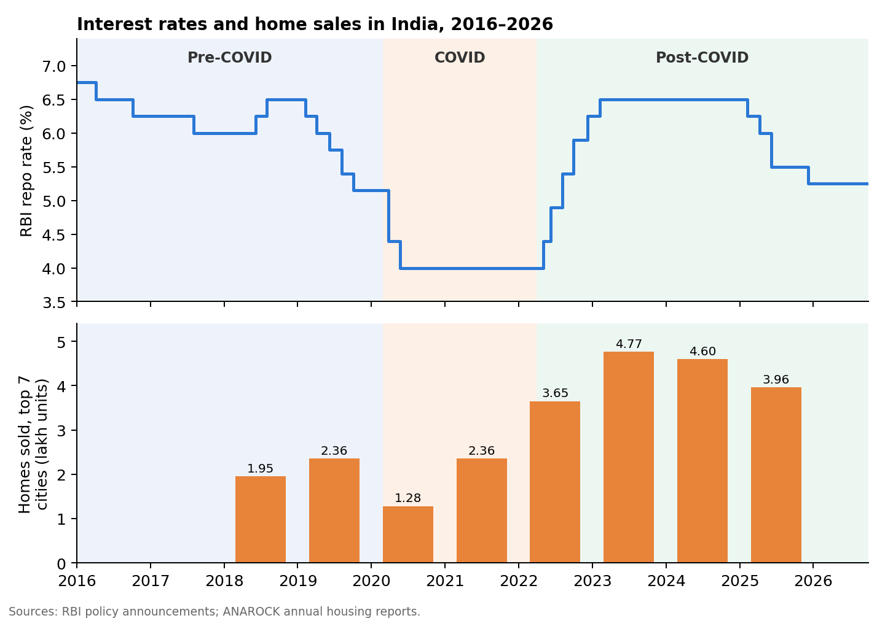
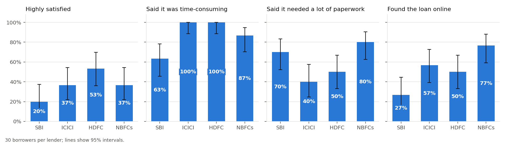

# A Study on Home Loans with Special Reference to Mortgage Loans in India: Before, During and After COVID-19

*Harsh Raj · September 2026*

*Every loan figure in this paper can be reproduced with the [calculator](https://harsh-github007.github.io/Mortgage-Loans-in-India/), and the survey analysis with [`survey/analyze.py`](../survey/analyze.py).*

## Executive Summary

Housing is one of the three basic needs of life, and for most families in India a home is the largest purchase they will ever make. Very few can pay for it outright, so the home loan is the instrument that turns the wish for a house into ownership. A mortgage loan is a loan secured by property: a buyer pledges the home being bought, or an owner pledges an existing property to raise money for another purpose. The lender holds a claim on the property until the loan is repaid. Since the National Housing Bank was set up, India's housing finance industry has grown from a small, tightly regulated sector into a competitive market served by public and private banks and housing finance companies (HFCs).

This study follows that market through three periods:

- **Pre-COVID (2016 to February 2020):** a slowdown after demonetisation, GST and RERA, and a credit squeeze on non-bank lenders after IL&FS and DHFL. It ended with falling interest rates and, from October 2019, home loans linked to the RBI repo rate.
- **COVID (March 2020 to March 2022):** a repayment moratorium, loan restructuring, the lowest home-loan rates in two decades, a collapse in sales in 2020 and a recovery in 2021.
- **Post-COVID (April 2022 to 2026):** 2.5 percentage points of rate rises, record home sales, the merger of HDFC into HDFC Bank, and in 2025 a new round of rate cuts.

The study combines market data for each period, loan calculations for borrowers in each period, and a survey of 120 home-loan borrowers at SBI, ICICI Bank, HDFC and non-bank lenders.

The main findings:

1. **When you borrowed mattered more than whom you borrowed from.** On a ₹50 lakh, 20-year loan, total interest was ₹56.0 lakh at 2019's rates, ₹40.9 lakh at the 2021 low, ₹59.1 lakh at the 2023 peak and ₹44.8 lakh today.
2. **COVID-era borrowers carried the most risk.** A loan taken at 6.70% in mid-2021 had its rate pushed to 9.20% by 2023. With the EMI unchanged, the loan would have stretched to 45 years if rates had stayed there. Even after the 2025 cuts, it runs 7½ years longer and costs ₹33.8 lakh more in interest than planned.
3. **The moratorium was expensive.** Deferring six EMIs in 2020 saved a borrower ₹2.5 lakh at the time. It added 2¾ years and about ₹11 lakh of interest to the loan.
4. **The tax case for a home loan has weakened.** Before COVID, a salaried borrower saved up to ₹92,500 a year in tax through the loan. Today the new tax regime, which gives no home-loan deduction, is cheaper at every salary tested.
5. **Borrowers complain about the process, not the price.** In the survey, 88% found getting a loan time-consuming but 82% thought their rate fair.

## Chapter 1: Introduction and Background

### 1.1 Mortgage loans and their types

A mortgage is a debt secured by property. Borrowers can be individuals, who mortgage a house, flat or plot, or businesses, which mortgage offices, shops or rented buildings. The amount, tenure, interest rate and repayment method vary widely. The main types of mortgage loan in India are:

- **Home loan:** to buy, build or extend a home. The home is the security, tenures run up to 30 years, and lenders usually finance 75–90% of the property's value.
- **Loan against property (LAP):** an owner pledges an existing property to raise money for any purpose. It is typically 50–70% of the property's value, at a higher rate than a home loan.
- **Commercial purchase loan:** to buy an office, shop or other commercial property.
- **Lease rental discounting:** a loan against future rent from a property already let to a tenant.
- **Second mortgage:** a further loan on a property that is already mortgaged, ranking behind the first lender.
- **Reverse mortgage:** for owners over 60, who receive regular payments against their home, and the loan is settled when the home is sold.

Mortgage loans carry lower rates than personal loans because they are secured. They can run for long periods with smaller instalments, and individual borrowers pay no penalty for prepaying a floating-rate loan.

### 1.2 How a home loan is priced

A floating-rate home loan in India has two parts: a benchmark rate that moves with the market, and a spread that the lender fixes when the loan is made. What the benchmark is has changed over the period of this study.

- **Until September 2019,** banks priced loans off their own marginal cost of funds lending rate (MCLR). Because each bank set its own MCLR, cuts in the RBI's policy rate reached borrowers slowly and only in part.
- **From 1 October 2019,** the RBI required banks to link all new floating-rate retail loans to an external benchmark, which in practice is the repo rate [1]. Since then, a change in the repo rate reaches a borrower at the next reset, usually within three months.
- **HFCs** such as LIC Housing Finance and PNB Housing Finance still price off their own prime lending rates.

External benchmarking is the reason the three periods in this study affected borrowers so differently. For the first time, the rate cuts of 2020 and the rate rises of 2022–23 passed almost entirely into existing loans.

### 1.3 Government programmes

- **Pradhan Mantri Awas Yojana (PMAY), 2015.** Its Credit Linked Subsidy Scheme (CLSS) paid interest subsidies of up to about ₹2.67 lakh to first-time buyers. The scheme for middle-income groups closed in March 2021, and the one for lower-income groups in March 2022.
- **PMAY-Urban 2.0, approved in 2024.** It restarted the subsidy: households earning up to ₹9 lakh a year and buying homes worth up to ₹35 lakh can receive up to ₹1.8 lakh [2].
- **Real Estate (Regulation and Development) Act (RERA), 2016.** It made developers register projects and keep buyers' money in escrow, which reduced the risk of lending on homes still being built.

## Chapter 2: Home Loans Across Three Eras

| | Pre-COVID (2019) | COVID (2021) | Post-COVID peak (2023) | Today (2026) |
| --- | ---: | ---: | ---: | ---: |
| RBI repo rate | 6.50% → 5.15% | 4.00% | 6.50% | 5.25% |
| SBI home-loan rate, from | about 8.75% | 6.70% | 9.15% | 7.25% |
| EMI on ₹50 lakh, 20 years | ₹44,186 | ₹37,870 | ₹45,470 | ₹39,519 |
| Total interest | ₹56.0 lakh | ₹40.9 lakh | ₹59.1 lakh | ₹44.8 lakh |
| Interest as % of the loan | 112% | 82% | 118% | 90% |
| Homes sold, top 7 cities | 2.36 lakh | 2.36 lakh | 4.77 lakh | 3.96 lakh (2025) |

*Rates from [3, 4, 5, 6]; sales from ANAROCK [7, 8, 9]; EMI and interest calculated.*

### 2.1 Pre-COVID (2016 to February 2020)

The housing market entered this period weak. Sales in the seven largest cities had peaked at 3.43 lakh homes in 2014, and fell to 1.95 lakh in 2018 [7]. Three changes hit developers in quick succession: demonetisation in November 2016, GST in July 2017, and RERA from 2017. Many developers had to finish stalled projects before they could launch new ones.

The bigger shock came from finance. In September 2018, Infrastructure Leasing & Financial Services (IL&FS) defaulted, and lenders stopped rolling over short-term borrowing by non-bank lenders and HFCs. Dewan Housing Finance (DHFL), then one of the largest HFCs, defaulted in 2019. It became the first finance company referred for insolvency. HFCs, which had been winning home-loan customers from banks, had to slow lending, and banks took back market share.

For borrowers, rates were high but falling. The RBI cut the repo rate five times in 2019, from 6.50% to 5.15%. Under MCLR pricing, however, SBI home loans still started at about 8.75% for much of the year [3]. The government added incentives:

- The home-loan interest deduction stayed at ₹2 lakh a year.
- Section 80EEA allowed first-time buyers of affordable homes a further ₹1.5 lakh deduction (loans sanctioned April 2019 to March 2022).
- CLSS subsidies were extended to middle-income buyers.

From October 2019, new floating-rate loans were linked to the repo rate. Sales recovered to 2.36 lakh homes in 2019 [7].

### 2.2 COVID (March 2020 to March 2022)

The nationwide lockdown from late March 2020 stopped site visits, registrations and construction. The RBI responded on three fronts:

- **Rates:** it cut the repo rate from 5.15% to 4.40% on 27 March 2020 and to 4.00% on 22 May 2020, and held it there for two years.
- **Moratorium:** lenders could let borrowers defer EMIs falling due from 1 March to 31 August 2020. Interest kept accruing and was added to the loan [10].
- **Restructuring:** under Resolution Framework 1.0 (August 2020), and 2.0 (May 2021) after the second wave, lenders could reschedule loans of stressed borrowers with exposures up to ₹25 crore, including extending the tenure by up to two years [10].

Sales in the top seven cities fell to 1.28 lakh homes in 2020, the lowest in the period [7]. The recovery was quick. Home-loan rates fell to the lowest in two decades: SBI's started at 6.70% in 2021 and some lenders offered 6.5% [3]. Maharashtra cut stamp duty from September 2020 to March 2021. Working from home made a larger home, or a first home outside a crowded city, worth more to many families. Sales in the first quarter of 2021 were 29% above a year earlier and above pre-COVID levels [11], and 2021 as a whole matched 2019 at 2.36 lakh homes [7].

In 2020 the Budget also introduced a new, optional income-tax regime with lower slabs and almost no deductions, including none for a home loan on a self-occupied property. In 2020 few chose it, but it became central in the next period.

### 2.3 Post-COVID (April 2022 to 2026)

As inflation rose after the pandemic and the war in Ukraine, the RBI raised the repo rate six times between May 2022 and February 2023, from 4.00% to 6.50%. Because most home loans were now repo-linked, the full 2.5 points reached existing borrowers within months. SBI's starting rate rose to 9.15% [4]. Most lenders kept EMIs unchanged and lengthened loans instead. Some tenures stretched past the borrower's retirement age, and in August 2023 the RBI told lenders to explain rate resets to borrowers and let them choose between a higher EMI, a longer tenure, or switching to a fixed rate.

Higher rates did not stop the housing market. Sales in the top seven cities set records:

| Year | Homes sold | Change |
| --- | ---: | --- |
| 2022 | 3.65 lakh | above the 2014 peak |
| 2023 | 4.77 lakh | record |
| 2024 | 4.60 lakh | sales value up 16%, to ₹5.68 lakh crore [8] |
| 2025 | 3.96 lakh | down 14% amid IT layoffs and tariff tensions, although value rose to over ₹6 lakh crore and average prices rose 8% [9] |

Demand shifted towards larger and costlier homes. Outstanding housing loans reached about ₹27 lakh crore by March 2024, up ₹10 lakh crore in two years [12]. Part of that jump reflects HDFC Ltd, India's largest HFC, merging into HDFC Bank in July 2023, which moved its loans onto a bank's books.

In 2025, with inflation under control, the RBI cut the repo rate four times, from 6.50% to 5.25%, and held it there in August 2026 [5]. Starting rates in September 2026 run from 7.20% (Punjab National Bank) and 7.25% (SBI) to 8.35% (Axis Bank) [6]. Tax changes moved the other way for borrowers:

- The new regime became the default in 2023.
- From 2025 it charges no tax on salaries up to ₹12.75 lakh [13].
- Because it gives no home-loan deduction, fewer borrowers now gain anything in tax from their loan.

## Chapter 3: Review of Literature

Earlier Indian studies of housing finance fall into two groups.

**The industry.** Koti Reddy (2011) described the structure of the Indian mortgage industry and the entry of banks into a market once led by HFCs. Vikkraman (2004) and Dhanija (2015) traced the growth of HFCs, using LIC Housing Finance as a case. Pushpa Sangwan (2012) and Chauhan (2017) compared public and private sector banks, and found private banks faster to process loans and public banks cheaper.

**Borrowers.** Nazrine (2017), Nalluswamy (2012) and Aarti Verma (2015) surveyed borrowers' awareness and satisfaction, and found that interest rate, processing time and documentation shape the choice of lender.

Outside India, Vandell (2008) studied the rise and fall of US house prices from 1998 to 2008, a reminder of how credit conditions drive housing cycles.

These studies predate both the repo-linked loan and the pandemic. This paper adds to them by comparing borrowers' costs across the rate cycle from 2019 to 2026, the first in which policy-rate changes passed directly into home loans.

## Chapter 4: Research Methodology

**Objectives of the study:**

1. To analyse the Indian home-loan market and its trends before, during and after COVID-19.
2. To measure what the changes in each period meant for the cost of a typical home loan.
3. To study the leading lenders in the mortgage-loan market.
4. To conduct a survey of borrowers to gauge their preferences and the factors behind their choice of bank or HFC.
5. To suggest how banks and HFCs could improve their home-loan services.

**Research design.** The study is exploratory and descriptive. It uses secondary data on the market in each period, loan calculations, and primary data from a borrower survey.

**Secondary data.** The sources are:

- RBI policy statements and circulars.
- Lenders' published rates.
- ANAROCK's housing market reports.
- Financial news reports citing RBI data.

The references list each source.

**Loan calculations.** The calculations use standard amortisation for a ₹50 lakh, 20-year loan, with monthly rests and repo-rate changes passed through in the month after each RBI decision. The calculator and its tests are published with this paper.

**Primary data.** The survey was conducted in 2022, as the COVID period ended. Its main features:

- **Sample:** 120 home-loan borrowers, 30 each from SBI, ICICI Bank, HDFC and non-bank lenders (NBFCs and HFCs), reached through personal contact.
- **Respondents:** salaried employees, self-employed professionals, business owners and homemakers.
- **Questionnaire:** occupation, age, gender, how long ago the loan was taken, satisfaction, reasons for choosing the lender, sources of information, views on the rate, processing time and paperwork, and awareness of terms and conditions.

**Tools of analysis.** Results are shown as percentages and charts. To check whether lenders really differ, each question was tested with a permutation test (20,000 random reshuffles of answers across lenders), suited to groups of 30. Cramér's V measures the size of any difference, and Holm's method adjusts for testing 11 questions at once.

## Chapter 5: Data Analysis and Interpretation

### 5.1 The cost of the same loan in each period

The table in Chapter 2 shows that the rate environment changed the cost of an identical loan by more than the choice of lender does today. Total interest on a ₹50 lakh, 20-year loan was:

| Period | Rate | Total interest |
| --- | ---: | ---: |
| 2021 low | 6.70% | ₹40.9 lakh |
| 2023 peak | 9.15% | ₹59.1 lakh |

That is a difference of ₹18.2 lakh. By comparison, the gap between the cheapest (7.20%) and dearest (8.35%) mainstream lender in September 2026 is worth ₹8.5 lakh. In every period, most early payments go to interest: 73–83% of the first year's EMIs.

### 5.2 Borrowers who lived through the rate cycle

With repo-linked loans, a borrower's rate follows the RBI for the life of the loan, so what matters is the path of rates after borrowing. Two borrowers illustrate this. Each took a ₹50 lakh, 20-year loan and kept the EMI unchanged through every rate change, which is how lenders adjust by default.

**Borrower A: October 2019, pre-COVID, at 8.15%** (repo 5.15% plus a 3-point spread). Their rate path:

1. Fell to 7.00% during COVID.
2. Rose to 9.50% by 2023.
3. Returned to 8.25% after the 2025 cuts.

The low COVID years let the borrower repay principal faster, and that offset most of the later rises. The loan ends only 3 months later than planned and costs ₹1.0 lakh more in interest.

**Borrower B: June 2021, COVID low, at 6.70%** (repo 4.00% plus a 2.7-point spread).

- **Their rate rose to 9.20% by March 2023.** At that rate, the monthly interest of about ₹37,160 used up almost all of the ₹37,870 EMI. The loan barely shrank.
- **Without cuts, 45 years.** Had rates stayed at the 2023 peak, the loan would have run 541 months.
- **With the 2025 cuts, 27½ years.** The loan now runs 330 months, 7½ years longer than planned, and costs **₹33.8 lakh more in interest**.

This is the situation that led the RBI to require lenders to offer a choice between a higher EMI and a longer tenure. Borrowers who took the cheapest loans of the pandemic, often first-time buyers, took the largest rate risk.

### 5.3 The cost of the moratorium

Take Borrower A's loan at 8.15% and suppose the borrower deferred all six EMIs from March to August 2020, as the moratorium allowed, with interest added to the loan and the EMI unchanged afterwards.

- **Relief at the time:** the six deferred EMIs came to ₹2.5 lakh.
- **Cost later:** the loan ends **33 months later** and total interest rises by about **₹11.1 lakh**.

The deferred interest is repaid at the end of the loan, where each extra month costs a full EMI. For borrowers who could still pay, the moratorium was an expensive form of credit. It was valuable for those whose incomes had actually stopped.

### 5.4 The tax benefit, then and now

Take a salaried borrower under 60 living in the home, with a ₹50 lakh loan.

**Pre-COVID, FY 2019-20: the loan always saved tax.** There was only one tax regime. Deducting first-year interest (up to ₹2 lakh) and principal (within the ₹1.5 lakh Section 80C limit) cut tax as follows:

| Salary | Tax saved in year 1 |
| --- | ---: |
| ₹10 lakh | ₹61,700 |
| ₹15 lakh or more | ₹92,500 |

**Post-COVID, FY 2026-27: the loan no longer decides the regime.** The same deductions exist only in the old regime, and the new regime is cheaper even after them:

| Salary | New regime cheaper by |
| --- | ---: |
| ₹10 lakh | ₹41,000 (new-regime tax is nil) |
| ₹15 lakh | ₹61,500 |
| ₹25 lakh | ₹1.51 lakh |

A home loan is no longer a tax-saving tool for most salaried owner-occupiers. It still helps those with large other deductions, and buyers of let-out property.

### 5.5 Survey of borrowers

| Question | Share shown | SBI | ICICI | HDFC | NBFCs | p-value | Adjusted p |
| --- | --- | ---: | ---: | ---: | ---: | ---: | ---: |
| Getting the loan was time-consuming | Agree | 63% | 100% | 100% | 87% | < 0.001 | < 0.001 |
| How long ago the loan was taken | Under a year | 20% | 40% | 63% | 50% | 0.002 | 0.018 |
| It needed a lot of paperwork | Yes | 70% | 40% | 50% | 80% | 0.007 | 0.063 |
| Satisfaction with the lender | Highly satisfied | 20% | 37% | 53% | 37% | 0.020 | 0.162 |
| Where they learned about the loan | Online | 27% | 57% | 50% | 77% | 0.028 | 0.198 |
| Occupation | Business owners | 37% | 20% | 20% | 50% | 0.039 | 0.235 |
| Rate is in line with the market | Agree | 87% | 77% | 93% | 70% | 0.109 | 0.436 |
| Main reason for choosing the lender | Interest rate | 70% | 67% | 63% | 77% | 0.374 | 1.000 |
| Aware of all terms and conditions | Yes | 67% | 70% | 77% | 73% | 0.902 | 1.000 |

**Interpretation:**

- **The process was the main complaint.** 88% of borrowers found getting a loan time-consuming and 60% said it needed a lot of paperwork. Yet 82% thought their interest rate was in line with the market, and 69% chose their lender mainly on rate. The survey was taken as rates sat at their COVID lows, which helps explain the contentment with price.
- **Lenders differed most on processing time.** Every ICICI and HDFC borrower found the process time-consuming, against 63% at SBI. This is the only difference that remains clear after adjusting for the number of tests. Paperwork was most often a burden at NBFCs (80%) and least at ICICI (40%).
- **Satisfaction was high but not deep.** 88% were satisfied or highly satisfied, but only 20% of SBI borrowers were *highly* satisfied, against 53% at HDFC.
- **The groups borrowed in different periods.** 77% of SBI borrowers took their loan 1–10 years earlier, mostly before COVID. 63% of HDFC borrowers and half of NBFC borrowers had borrowed in the past year, during the COVID-era boom in lending. Some differences between lenders may therefore reflect when people borrowed, not how each lender works.
- **Online became the main channel.** 53% of borrowers learned about their loan online, including 77% at NBFCs, against 27% at SBI, whose borrowers more often heard of it through television. This matches the shift to digital processing during the lockdowns.

## Chapter 6: Findings, Recommendations and Conclusion

### Findings

1. **Pre-COVID,** home loans were costly, with ₹56 lakh of interest on a ₹50 lakh loan at 2019 rates. Non-bank lenders were squeezed by the IL&FS and DHFL defaults. The move to repo-linked loans in October 2019 set up everything that followed.
2. **During COVID,** rates fell to two-decade lows and the moratorium and restructuring kept borrowers out of default. Deferring EMIs was expensive, though, and loans taken at the lows carried the most risk when rates rose.
3. **Post-COVID,** a 2.5-point rise in rates lengthened loans rather than raising EMIs. Sales still hit records, and the 2025 cuts have brought rates back to about where they were before COVID. The new tax regime has taken away much of the tax case for borrowing.
4. **Borrowers value speed and simplicity** as much as price. Processing time is where lenders differ most.

### Recommendations

**For borrowers:**

- **Compare the spread over the repo rate, not the headline rate.** The spread is fixed for the life of the loan, and 1 percentage point costs about ₹7.5 lakh on a ₹50 lakh, 20-year loan.
- **When rates rise, raise the EMI rather than letting the tenure grow.** When rates fall, check that the lender has passed on the cut.
- **Use a moratorium or restructuring only if income has actually stopped.**
- **Prepay early where possible.** ₹5 lakh prepaid in year 3 saves ₹10.9 lakh of interest; the same ₹5 lakh in year 15 saves ₹1.9 lakh.
- **Compare both tax regimes before choosing the old one for the home loan.**

**For banks and HFCs:**

- **Cut processing time and paperwork.** This is where borrowers see the biggest differences between lenders. The digital processes adopted during COVID should become the norm.
- **Explain rate resets clearly,** and offer a choice between a higher EMI and a longer tenure.
- **Keep investing in online channels,** now the main way new borrowers find a loan.
- **Target first-time and affordable-housing buyers** eligible under PMAY-Urban 2.0.

### Conclusion

A mortgage loan is protected by the property it pays for, which is why it is the cheapest and longest credit most households will ever take. Between 2019 and 2026 the Indian home-loan market went through a full cycle in six years:

- falling rates and a shift to repo-linked pricing;
- a pandemic that froze the market and then revived it with the lowest rates in two decades;
- the sharpest rate rises in a decade, with record sales anyway;
- a new round of cuts.

Because loans are now linked to the repo rate, borrowers feel these cycles directly, in the length of their loans if not in their EMIs. The fundamentals behind housing demand, a young population, rising incomes and the move to nuclear families, have not changed. But the risk that a borrower's rate will move has shifted from the lender to the borrower. The best protection is to borrow with room to raise the EMI, prepay early, and treat the lowest rates of any cycle as temporary.

## Limitations

- **The survey is small and not random.** Thirty borrowers per lender can reveal only large differences. It was taken in 2022, so it reflects borrowers' views before the rate rises of 2022–23.
- **Rates are advertised starting rates.** Actual rates depend on credit score, loan size and employment, and before October 2019 many loans were priced off MCLR rather than the repo rate.
- **The loan examples assume full, immediate pass-through of repo changes** and a fixed spread. Real resets happen quarterly and vary by lender.
- **The tax examples are simplified.** They cover salaried residents under 60 and leave out surcharge.

## References

1. [RBI makes external benchmark based interest rate mandatory for certain categories of loans from October 1, 2019](https://www.rbi.org.in/Scripts/BS_PressReleaseDisplay.aspx?prid=48070), Reserve Bank of India press release, 4 September 2019
2. [PMAY-U 2.0: benefits, eligibility and subsidy](https://www.icicihfc.com/en/loans/home-loan/pmay-u-2-0), ICICI Home Finance
3. [Last 10 years home loan interest rates in India](https://www.nobroker.in/forum/last-10-years-home-loan-interest-rates-in-india/), NoBroker
4. [SBI Home Loan Interest Rate April 2023, starting from 9.15%](https://navi.com/blog/sbi-home-loan-interest-rate/), Navi
5. [RBI Policy Update August 2026: Repo Rate Unchanged at 5.25%](https://www.indiainfoline.com/news/economy/rbi-policy-update-august-2026-repo-rate-unchanged-at-5-25-fy27-gdp-growth-raised-to-6-7-inflation-forecast-cut), India Infoline; repo-rate history from [ClearTax](https://cleartax.in/s/repo-rate)
6. [Home Loan Interest Rates, September 2026](https://www.urbanmoney.com/home-loan/interest-rate), Urban Money (updated 28 September 2026)
7. [Milestone Year for Indian Residential Real Estate: 2022 Annual Report](https://websitemedia.anarock.com/media/Milestone_Year_for_Indian_Residential_Real_Estate_2022_ANAROCK_ANNUAL_REPORT_417a9fb439.pdf), ANAROCK
8. [Housing unit sales decline by 4% but value increased by 16% in 2024](https://www.tribuneindia.com/news/business/housing-unit-sales-decline-by-4-in-india-but-value-increased-by-16-in-2024-anarock/), The Tribune, citing ANAROCK
9. [Housing sales fall 14% in 2025 while value rises 6% across top 7 cities](https://mediabrief.com/housing-sales-fall-14-year-on-year-in-2025-while-value-rises-6-across-top-7-cities-anarock/), MediaBrief, citing ANAROCK
10. [COVID-19 home loan restructuring and moratorium](https://www.paisabazaar.com/home-loan/covid-19-home-loan-restructuring-and-moratorium/), Paisabazaar; [Resolution Framework 2.0](https://www.rbi.org.in/commonman/english/scripts/Notification.aspx?Id=3305), Reserve Bank of India
11. [Housing sales in 7 cities surge 29% in Q1 2021](https://www.business-standard.com/amp/article/economy-policy/housing-sales-in-7-cities-surge-29-hyderabad-records-max-sale-anarock-121032500445_1.html), Business Standard, citing ANAROCK
12. [Home loan outstanding up by ₹10 lakh crore in last 2 years](https://www.outlookbusiness.com/news/home-loan-outstanding-up-by-rs-10-lakh-crore-in-last-2-yrs-reaches-rs-27-lakh-crore-in-march-rbi-data), Outlook Business, citing RBI data
13. [Income Tax Slabs FY 2025-26 and FY 2026-27](https://cleartax.in/s/income-tax-slabs), ClearTax
14. T. Koti Reddy (2011), "A Study on Indian Mortgage Industry," *Indian Journal of Commerce and Management Studies*, 2(1), 1–11.
15. Nazrine N. (2017), *A Study on Awareness and Satisfaction of Borrowers of Housing Finance in Tiruchirapalli*.
16. Pushpa Sangwan (2012), *Analysis of Home Loans of Public and Private Sector Banks in India*.
17. Chauhan, N. S. (2017), *Customers' Perception towards Home Loans: A Comparative Study of Public and Private Sector Banks*.
18. Nalluswamy (2012), *A Study on Customer Perceptions and Satisfaction towards Home Loan in Namakkal*.
19. Vikkraman P. (2004), *Dynamics of Housing Finance in India*.
20. Dhanija E. (2015), *Housing Finance in India: A Case Study of LIC Housing Finance Limited*.
21. Aarti Verma (2015), *A Study on Customers' View and Perception towards Home Loan*.
22. Vandell, K. D. (2008), analysis of the rise and fall in US home prices, 1998–2008.
